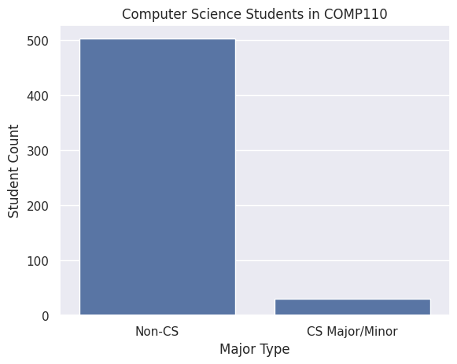
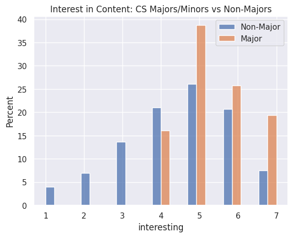

---
# Do not edit the text between these lines!
layout: default
---

# COMP 110 EX 09 SITE

### Creating COMP110 Focus Tracks to Facilitate Student Interest and Cater to Popular Majors

<!-- This is a comment. Below, you'll see code for inserting an image. To make this image appear, update <custom-path>. To add an image, save it inside the imgs folder of this repository. -->

## Summary
**Data Source**: Student surveys from Spring 2026 COMP110 sections 001 and 002.

**Goal**: Determine to what extent COMP110 students would benefit from major-specific focus track courses.

______________________________
## Analysis
### 1. Computer Science (CS) Majors/Minors vs Non-CS Majors/Minors:
From the larger dataset, only the “comp_major” responses (responding whether or not the student was a CS student) were considered. There were three possible affirmative responses: “Yes-BA”,”Yes-BA”, and “Yes-Minor.” These counts were conglomerated into a generalized CS Major/Minor count. Only “No” responses were considered in the Non-CS count. A bar plot was used to visualize the difference in student counts between CS Majors/Minors and Non-CS Majors/Minors.

### 2. COMP110 Course Content Interest: CS vs Non-CS Students:
In addition to the “comp_major” responses, student scores about interest in course content (1 to 7) were considered. Similar to the previous method, the three possible “Yes” responses were considered CS-Major responses. Each student’s response was categorized into a Major (orange) or Non-Major (blue) response, and their scores are shown on the x-axis. The responses are shown as a percent of their respective major affiliation count for normalization.

### 3. Prominent Majors in COMP110 and Course Valuability in Future:
Non-CS student majors and student scores about anticipated course valuability in the future were considered. Calculating the majors with student counts above 50, the most prominent majors in COMP110 were Neuroscience, Biology, and Economics. Only these majors were considered when analyzing the valuability data. The valuability scores of these three majors were graphed onto a histogram, and were normalized against their respective major totals.

### Conclusion:
**Rationale**: As non-CS majors in COMP 110, we were interested in the experiences of other non-majors in this course. Though this course is designed to be a broad introduction to computer programming, we wondered whether there was demand for more content relevant to specific majors.

We believe it may be beneficial to offer specialized focus tracks to make the applicability of these skills in non-CS fields more explicit. This would show students programming skills that are useful to their majors.

**Findings**: To support this idea, we wanted to break down the student population by their majors. The bar chart comparing the population of CS and non-CS students showed us that the overwhelming majority of COMP 110 students are not CS majors or minors. This graph primarily supports our idea by suggesting that a large student population would benefit from these tracks.

From the second visual, we found that CS students tend to report a higher interest in course content than other students. CS students report interest levels of 4 or higher, while the interest levels of other students resemble a bell curve. Nearly 30% of non-CS students report that the content is uninteresting to them (responses of 1-3). We hypothesize that introducing focus tracks may help these students gain more interest in the content, seeing explicit applications in their disciplines. It should be noted, however, that the low CS student count may contribute to skewed data.

We also visualized the distributions of beliefs in the value of course content in the three most popular majors in COMP 110: Biology, Neuroscience, and Economics. The right skew shows that most students in these majors believe that COMP 110 skills are valuable for their future. This creates a demand for focus tracks, particularly in these fields, providing valuable programming fundamentals specifically applied to material that students find interesting.

**Limitations**: There exist some limitations to implementing focus tracks. Opening options for only popular majors/interests may overlook other majors and interests. It would be difficult to create focus tracks for every major at UNC, even though there may be demands to explore the intersection of programming and these disciplines. Focus tracks can also divert students’ attention from the programming fundamentals and introduce complexities that students are not adequately prepared for. Introducing focus tracks would also create a demand for a specialized teaching team, which may be difficult to implement efficiently. Additionally, COMP 116, Intro to Scientific Programming, is similar to COMP 110 but focused on science applications. Science-oriented students may have chosen COMP 110 to explore broader applications of programming, and adding focus tracks would defeat that goal.

**Extentions/Future**: In the future, if the COMP 110 team could gather data on student interest in these focus tracks, this idea may be refined to offer specialized, but still broad COMP 110 tracks. These tracks, rather than being catered to specific majors, may apply to broad areas, such as natural science or finance. Depending on the results of this student interest, it may also be beneficial to continue offering the general COMP 110, especially for students desiring the generalized course.

Overall, there are many challenges associated with introducing focus tracks. However, with a large non-CS student population, a large spread in interest in the non-CS population, and high demand for programming skills, it is necessary to align this course with the interests of the majority. By implementing focus tracks, students may find it easier to gain value from and be interested in the content of COMP 110.

